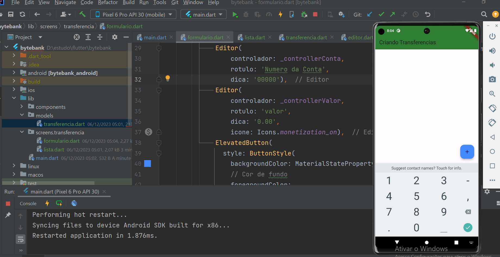
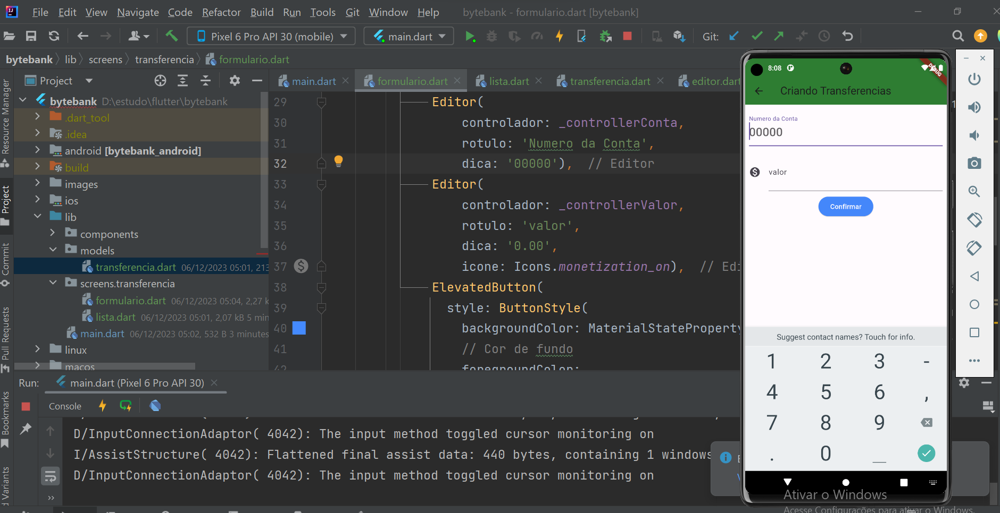
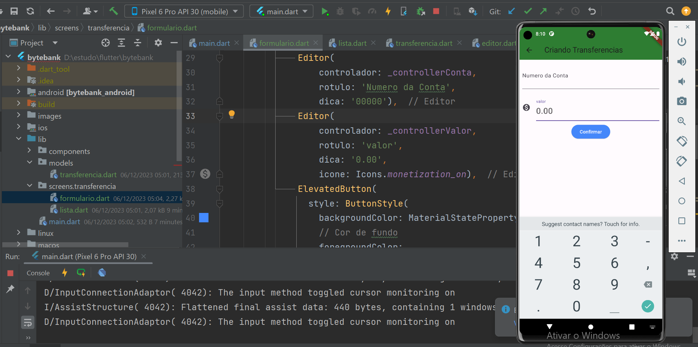
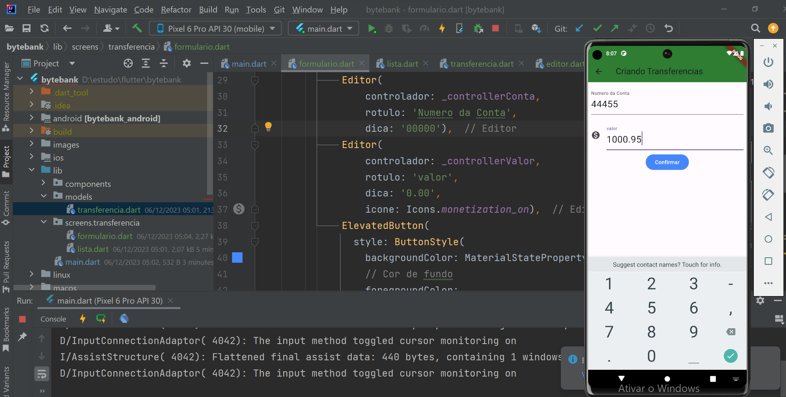
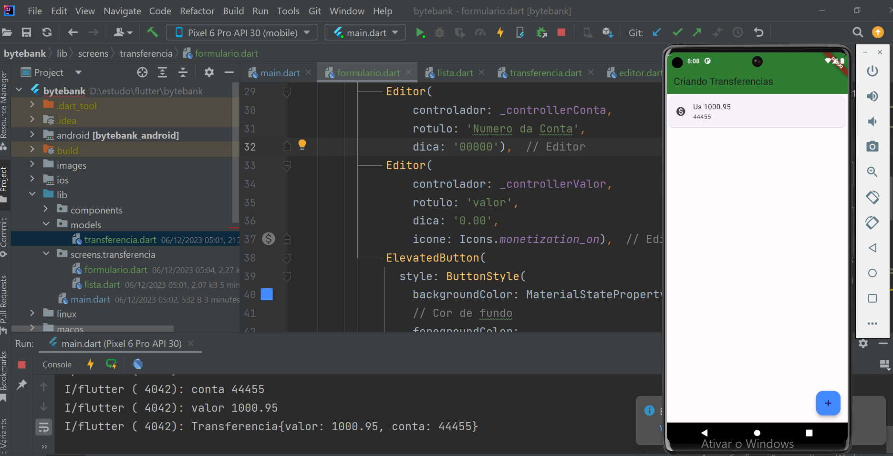

# bytebank

## Introdução

Tratasse de um projeto básico apresentado pelo curso Alura com o intuito de introdução ao Flutter

Basicamente se trata de uma tela de listagem que estará representando uma lista de contas e seu saldo e mais um formulário de entrada para o numero da conta e seu saldo onde o foco está apenas na apresentação de conceitos de utilização do framework.
 

## Aprendizado

- **Parte 1**

  - O que é o Flutter;
  - Como instalar e preparar o ambiente para o Flutter;
  - Criar e executar o primeiro projeto;
  - Abrir o projeto no IntelliJ, editar o código e executá-lo;
  - O que são Widgets e como funciona a estrutura para criar layouts no Flutter.

- **Parte 2**

  - A implementar um layout com os componentes do Material Design;
  - Atalhos e dicas para auxiliar a implementação do layout;
  - Refatorar os próprios Widgets;
  - O que é StatelessWidget e StatefulWidget;
  - Organizar e reutilizar código no Flutter.

- **Parte 3**

   - Maneiras de evitar Widgets inesperados para outras telas;
   - Como habilitar e utilizar o Hot Reload;
   - Criar um layout para formulário;
   - Aplicar margem em Widgets;
   - Como pegar o valor e estilizar TextField.

- **Parte 4**

  - Refatorar Widget para receber argumentos opcionais nomeados;
  - Navegar entre páginas por meio do Navigator;
  - Receber informações ao realizar o pop durante a navegação;
  - Como lidar com operações assíncronas usando o Future;
  - Implementar o ListView com o builder;

- **Parte 5**

  - Implementar StatefulWidgets;
  - Evitar bugs comuns na implementação de fluxo de tela e formulário;
  - Ajustar o tema do App com as cores do Color Tool;
  - Organizar a estrutura do projeto.

 
- [Breve descrição do curso](info/infoCursotxt.txt)
 

## Resultados alcançados

- listagem inicial

- formulario conta em foco

- formulario valor em foco
 

- formulario conta edição

- formulario listagem conta

 